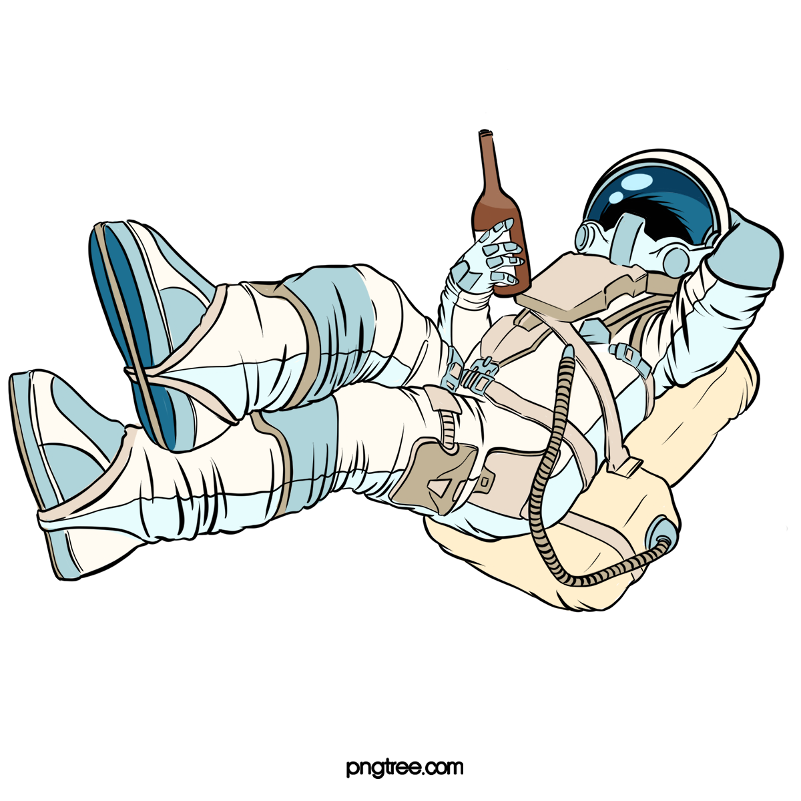

<h1 align="center">
  

  :satellite:<p> HOUSTON, WE DONT HAVE A PROBLEN!!
</h1>

## How to use and where is that
    Well all that app using request http, for comunicate.
    This project look for, implement, a software architecture called API REST, where your backend, your requests and queries are completely independent of the platform you use, whether with a web browser, mobile app, whatever


#  :cloud: :computer:About
  I create this reposotory, because this is my first API using [node](https://nodejs.org/en/docs/) with lib express and live server nodemon, 
  The purpose with that is, before look to the code
  an using for consulting.

## :hammer:Tools
- [node](https://nodejs.org/en/docs/)
- [yarm](https://classic/yarnplg/com)
- [express](https://expressjs.com)
- [nodemon](https://nodemon.io) 

## :recycle: How to contribute
```bash
#clone the project

$ git clone https://github.com/deivid94/javascript_for_backend_fundamentos.git
 ```


